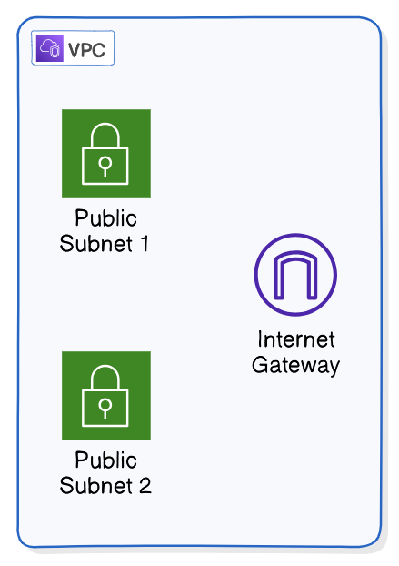
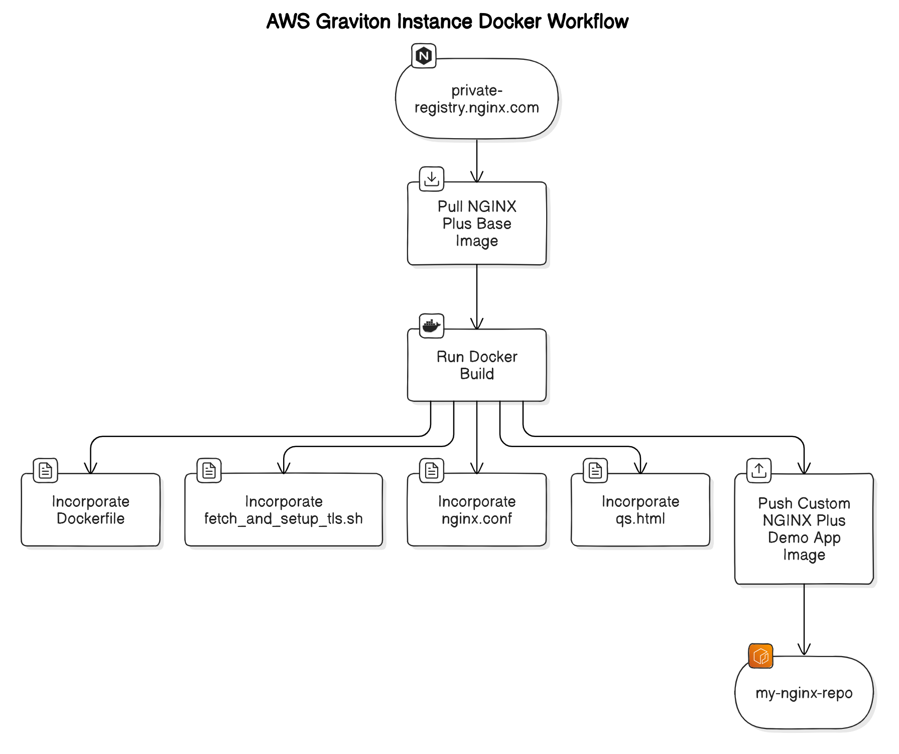
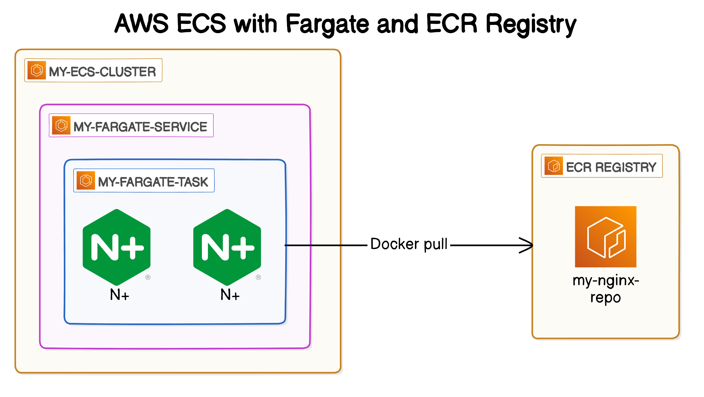
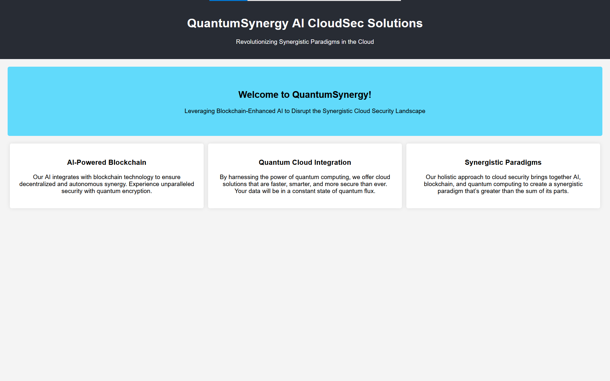

# Deploying NGINX Plus Graviton-powered containers as AWS ECS Fargate Tasks

The latest AWS _EC2 R8g Graviton_ instance types have now reached [General Availability (GA)](https://aws.amazon.com/blogs/aws/aws-graviton4-based-amazon-ec2-r8g-instances-best-price-performance-in-amazon-ec2/). Running NGINX Plus as a containerized service on Graviton instances in AWS aligns with current best practices in cloud-native design patterns. This approach often leads to cost savings and performance gains for suitable workloads.

## Introduction

[NGINX Plus](https://www.f5.com/go/faq/nginx-faq), the commercial version of the popular open-source NGINX reverse proxy / Kubernetes ingress / application server, offers advanced features crucial for modern cloud architectures. NGINX Plus can effectively replace Amazon's native load balancers and [serve as a more feature-rich alternative to Elastic Kubernetes Services Ingress](https://github.com/nginxinc/kubernetes-ingress). Its versatility supports all cloud-native design patterns and seamlessly integrates with the AWS ecosystem.

This tutorial leverages several AWS technologies:

- [**Graviton ARM64 instances**](https://aws.amazon.com/ec2/graviton/resources/): These offer a significant price-performance advantage over x86 instance types in AWS.
- **ECS (Elastic Container Service)**: A fully managed container orchestration service.
- **Fargate**: A serverless compute engine for containers, eliminating the need to provision and manage servers.
- **ECR (Elastic Container Registry)**: A fully managed container registry for storing, managing, and deploying container images.
- **AWS Secrets Manager**: Securely stores and manages sensitive information like TLS certificates and private keys.

What is the difference between ECS and ECS Fargate?

The key difference between AWS ECS (Elastic Container Service) and AWS ECS Fargate lies in the level of infrastructure management:

- AWS ECS:
   - You manage the underlying EC2 instances that host your containers
   - You're responsible for patching, scaling, and maintaining these instances

- AWS ECS Fargate:
   - Serverless compute engine for containers
   - AWS manages the underlying infrastructure
   - You only need to specify CPU and memory requirements for your containers

In essence, Fargate abstracts away the server management aspect, allowing you to focus solely on your containerized applications, while standard ECS gives you more control but requires more hands-on management of the underlying infrastructure.

While this tutorial doesn't cover it, [NGINX Plus can send logs to CloudWatch](https://aws.amazon.com/blogs/mt/use-amazon-cloudwatch-contributor-insights-for-general-analysis-of-nginx-logs/).

By the end of this guide, you'll have a solid understanding of how to configure, deploy, and quickly scale NGINX Plus on AWS ECS [Graviton-powered clusters](https://www.aboutamazon.com/news/aws/graviton4-aws-cloud-computing-chip).


## Part 1: Prepare AWS Environment

AWS Command Line version tested:

```bash
aws --version
```

`aws-cli/2.17.0 Python/3.11.8 Linux/5.15.146.1-microsoft-standard-WSL2 exe/x86_64.ubuntu.20`

### 1. Set Up VPC Infrastructure

If you already have a VPC with two public subnets, you can skip this part.

#### 1.1 Create a VPC

```bash
VPC_ID=$(aws ec2 create-vpc --cidr-block 10.0.0.0/16 --query 'Vpc.VpcId' --output text)
echo "VPC ID: $VPC_ID"
```

#### 1.2 Create an Internet Gateway

```bash
IGW_ID=$(aws ec2 create-internet-gateway --query 'InternetGateway.InternetGatewayId' --output text)
echo "Internet Gateway ID: $IGW_ID"

aws ec2 attach-internet-gateway --internet-gateway-id $IGW_ID --vpc-id $VPC_ID
```

#### 1.3 Create Subnets

```bash
# Get available Availability Zones
AZS=($(aws ec2 describe-availability-zones --query 'AvailabilityZones[].ZoneName' --output text))

# Create subnet in the first AZ
SUBNET1_ID=$(aws ec2 create-subnet \
    --vpc-id $VPC_ID \
    --cidr-block 10.0.1.0/24 \
    --availability-zone ${AZS[0]} \
    --query 'Subnet.SubnetId' \
    --output text)

# Create subnet in the second AZ
SUBNET2_ID=$(aws ec2 create-subnet \
    --vpc-id $VPC_ID \
    --cidr-block 10.0.2.0/24 \
    --availability-zone ${AZS[1]} \
    --query 'Subnet.SubnetId' \
    --output text)

echo "Subnet 1 ID: $SUBNET1_ID (AZ: ${AZS[0]})"
echo "Subnet 2 ID: $SUBNET2_ID (AZ: ${AZS[1]})"
```

#### 1.4 Set Up Routing

```bash
ROUTE_TABLE_ID=$(aws ec2 create-route-table --vpc-id $VPC_ID --query 'RouteTable.RouteTableId' --output text)
echo "Route Table ID: $ROUTE_TABLE_ID"

aws ec2 create-route --route-table-id $ROUTE_TABLE_ID --destination-cidr-block 0.0.0.0/0 --gateway-id $IGW_ID

aws ec2 associate-route-table --subnet-id $SUBNET1_ID --route-table-id $ROUTE_TABLE_ID
aws ec2 associate-route-table --subnet-id $SUBNET2_ID --route-table-id $ROUTE_TABLE_ID
```

#### 1.5 Configure Subnets for Public IP Assignment

```bash
aws ec2 modify-subnet-attribute --subnet-id $SUBNET1_ID --map-public-ip-on-launch
aws ec2 modify-subnet-attribute --subnet-id $SUBNET2_ID --map-public-ip-on-launch
```

#### 1.6. Create Security Group

```bash
SG_ID=$(aws ec2 create-security-group --vpc-id $VPC_ID --group-name docker-client-sg --description "Security group for Graviton Docker instance" --query 'GroupId' --output text)
echo "Security Group ID: $SG_ID"

# Allow SSH access from your IP
aws ec2 authorize-security-group-ingress --group-id $SG_ID --protocol tcp --port 22 --cidr YOUR_IP_ADDRESS/32

# Allow HTTP and HTTPS access from anywhere
aws ec2 authorize-security-group-ingress --group-id $SG_ID --protocol tcp --port 80 --cidr 0.0.0.0/0
aws ec2 authorize-security-group-ingress --group-id $SG_ID --protocol tcp --port 443 --cidr 0.0.0.0/0

# Allow ICMP from anywhere (for ping)
aws ec2 authorize-security-group-ingress --group-id $SG_ID --protocol icmp --port -1 --cidr 0.0.0.0/0
```

#### 1.7 Create an Elastic Container Registry (ECR)

```bash
aws ecr create-repository --repository-name my-nginx-repo --region $AWS_REGION
```


### 2. Launch an EC2 Graviton Instance

#### 2.1 Find the latest Amazon Linux 2023 ARM64 AMI

```bash
AMI_ID=$(aws ssm get-parameter --name "/aws/service/ami-amazon-linux-latest/al2023-ami-kernel-6.1-arm64" --query "Parameter.Value" --output text)
echo "AMI ID: $AMI_ID"
```

#### 2.2 Launch an Amazon Linux 2023 Graviton instance

```bash
INSTANCE_ID=$(aws ec2 run-instances \
    --image-id $AMI_ID \
    --instance-type t4g.micro \
    --key-name YOUR_KEY_NAME \
    --security-group-ids $SG_ID \
    --subnet-id $SUBNET1_ID \
    --user-data '#!/bin/bash
dnf update -y
dnf install -y git jq docker
systemctl enable docker
systemctl start docker
usermod -a -G docker ec2-user' \
    --tag-specifications 'ResourceType=instance,Tags=[{Key=Name,Value=Graviton-Docker-Instance},{Key=Owner,Value=your.email@example.com}]' \
    --query 'Instances[0].InstanceId' \
    --output text)
echo "Instance ID: $INSTANCE_ID"
```

Watch for progress in the AWS console. EC2 => Instances => "Name = Graviton-Docker-Instance". Once Status check passses (green font) you can proceed.

#### 2.3 Get the public IP address of the instance

```bash
PUBLIC_IP=$(aws ec2 describe-instances --instance-ids $INSTANCE_ID --query 'Reservations[*].Instances[*].PublicIpAddress' --output text)
echo "Public IP: $PUBLIC_IP"
```

#### 2.4. Connect to the Amazon Linux 2023 instance and test Docker installation

SSH into your Amazon Linux 2023 instance:

```bash
ssh -i /path/to/your/key.pem ec2-user@$PUBLIC_IP
```

```
# Check Docker version
docker --version

# Run a test NGINX container
docker run --name mynginx -d -p 80:80 nginx

# Inspect the container
docker inspect mynginx

# Test the NGINX server
curl localhost

# Clean up
docker stop $(docker ps -aq) && docker rm $(docker ps -aq)
```

## Part 2: Building the Custom NGINX Plus ARM64 Container

### 1. IAM Roles and Permissions

#### 1.1 Create a trust policy and IAM role

The Graviton Docker build instance will need an IAM role to access the Elastic Container Registry (ECR).

Run these commands from your **local** machine or an AWS CLI enabled environment:

```bash
# Create trust policy file
cat > trust-policy.json << EOL
{
  "Version": "2012-10-17",
  "Statement": [
    {
      "Effect": "Allow",
      "Principal": {
        "Service": "ec2.amazonaws.com"
      },
      "Action": "sts:AssumeRole"
    }
  ]
}
EOL

# Create the IAM role
aws iam create-role --role-name MyEC2Role --assume-role-policy-document file://trust-policy.json

# Attach the AmazonEC2ContainerRegistryFullAccess policy to the role
aws iam attach-role-policy --role-name MyEC2Role --policy-arn arn:aws:iam::aws:policy/AmazonEC2ContainerRegistryFullAccess

# Create the instance profile
aws iam create-instance-profile --instance-profile-name MyEC2_InstanceProfile

# Add the role to the instance profile
aws iam add-role-to-instance-profile --instance-profile-name MyEC2_InstanceProfile --role-name MyEC2Role

# Associate the instance profile with your EC2 instance
aws ec2 associate-iam-instance-profile --instance-id $INSTANCE_ID --iam-instance-profile Name=MyEC2_InstanceProfile
```

### 2 Base NGINX Plus ARM64 Container Image

#### 2.1. Sign up for NGINX Plus trial

Sign up for an NGINX Plus trial at https://www.f5.com/trials. After signing up, you'll receive a JSON Web Token (JWT) to authenticate to private-registry.nginx.com. 

If you are an existing F5 customer, you can request a trial from the https://my.f5.com portal.

#### 2.2. Connect to the Amazon Linux 2023 instance

SSH into your Amazon Linux 2023 instance:

```bash
ssh -i /path/to/your/key.pem ec2-user@$PUBLIC_IP
```

#### 2.3. Set up Docker for NGINX Plus container registry

Set up Docker to communicate with the NGINX container registry located at private-registry.nginx.com.

Open the JSON Web Token file previously downloaded from MyF5 customer portal (for example, nginx-repo-12345abc.jwt) and copy its contents.

Log in to the docker registry using the contents of the JSON Web Token file:

```bash
docker login private-registry.nginx.com --username=<output_of_jwt_token> --password=none
```
Next, pull the image you need from private-registry.nginx.com.

```bash
docker pull private-registry.nginx.com/nginx-plus/base:r32
```

#### 2.4. Tag and Push the Base NGINX Plus image to ECR

```bash
# Get ECR repository URI
ECR_URI=$(aws ecr describe-repositories --repository-names my-nginx-repo --query 'repositories[0].repositoryUri' --output text)
echo "ECR Repository URI: $ECR_URI"

# Tag the base image
docker tag private-registry.nginx.com/nginx-plus/base:r32 $ECR_URI:r32

# Authenticate Docker to ECR (if not already done)
aws ecr get-login-password --region $AWS_REGION | docker login --username AWS --password-stdin $ECR_URI

# Push the base image to ECR
docker push $ECR_URI:r32
```

#### 2.5 Verify the pushed image

```bash
aws ecr list-images --repository-name my-nginx-repo
```

### 3. Custom NGINX Plus ARM64 Container Image

#### 3.1 Create and store ECDSA certificate and key as AWS secret

Before we create the ECS Service, we need to generate an ECDSA certificate and key, and store them in AWS Secrets Manager. This secret will be used by the `fetch_and_setup_tls.sh` script in our container.

```bash
# Generate the private key:
openssl ecparam -name prime256v1 -genkey -noout -out ecdsa_private_key.pem

# Generate a self-signed certificate:
openssl req -new -x509 -key ecdsa_private_key.pem -out ecdsa_certificate.pem -days 365 -subj "/CN=example.com"

# Create JSON formatted file that contains both the cert and key
jq -n --arg cert "$(cat ecdsa_certificate.pem)" --arg key "$(cat ecdsa_private_key.pem)" \
'{"certificate": $cert, "private_key": $key}' > secret.json

# Store the secret in AWS Secrets Manager
aws secretsmanager create-secret --name "MyTlsCertAndKey1" --secret-string file://secret.json
```

#### 3.2 Dockerfile


```bash
docker images
```

Look for the base image:

```bash
<your-account-id>.dkr.ecr.$AWS_REGION.amazonaws.com/my-nginx-repo:r32
```

Create a `Dockerfile`. Replace the base image in the Dockerfile with yours.

```dockerfile
# Use the existing nginx image as the base
FROM <your-account-id>.dkr.ecr.$AWS_REGION.amazonaws.com/my-nginx-repo:r32

# Install necessary packages in a single layer
RUN apt-get update && \
    apt-get install -y awscli jq less wget vim && \
    apt-get clean

# Ensure the permissions are correct for the HTML file
COPY qs.html /usr/share/nginx/html/index.html
RUN chmod 644 /usr/share/nginx/html/index.html

# Copy a custom nginx configuration file
COPY nginx.conf /etc/nginx/nginx.conf

# Script to fetch TLS cert and key from AWS Secrets Manager
COPY fetch_and_setup_tls.sh /usr/local/bin/fetch_and_setup_tls.sh
RUN chmod +x /usr/local/bin/fetch_and_setup_tls.sh

# Expose HTTP and HTTPS ports
EXPOSE 80 443

# Start NGINX
CMD /usr/local/bin/fetch_and_setup_tls.sh && nginx -g 'daemon off;'
```

#### 3.3 fetch_and_setup_tls.sh
Create a script that will run during the task container execution process and inject a TLS certificate and key from an AWS secret: `fetch_and_setup_tls.sh`.

```bash
#!/bin/bash

# Set secret ID
AWS_SECRET_ID='MyTlsCertAndKey1'

# TLS_CERT_AND_KEY environment variable found?
if [ -n "$TLS_CERT_AND_KEY" ]; then
    echo "$TLS_CERT_AND_KEY" > /tmp/secret.json
else
    echo "TLS_CERT_AND_KEY not found" > /tmp/log.txt
fi

# Extract the certificate and key files from AWS_SECRET_ID
aws secretsmanager get-secret-value --secret-id "$AWS_SECRET_ID" \
          | jq -r '.SecretString | fromjson | .certificate' > /etc/nginx/ecdsa_certificate.pem

aws secretsmanager get-secret-value --secret-id "$AWS_SECRET_ID" \
          | jq -r '.SecretString | fromjson | .private_key' > /etc/nginx/ecdsa_private_key.pem

# Set permissions on the certificate and key files
chmod 600 /etc/nginx/ecdsa_certificate.pem /etc/nginx/ecdsa_private_key.pem
```

#### 3.4 nginx.conf
Create your `nginx.conf`.

```nginx
worker_processes 1;

events {
    worker_connections 1024;
}

http {
    include       mime.types;
    default_type  application/octet-stream;

    sendfile        on;
    keepalive_timeout  65;

    server {
        listen 443 ssl;
        http2 on;
        server_name _;

        ssl_certificate /etc/nginx/ecdsa_certificate.pem;
        ssl_certificate_key /etc/nginx/ecdsa_private_key.pem;

        root /usr/share/nginx/html;
        index index.html;

        location / {
            try_files $uri $uri/ =404;
        }

        # Security improvements (optional but recommended)
        ssl_protocols TLSv1.2 TLSv1.3;
        ssl_prefer_server_ciphers on;
        ssl_ciphers "ECDHE-ECDSA-AES256-GCM-SHA384:ECDHE-RSA-AES256-GCM-SHA384:ECDHE-ECDSA-CHACHA20-POLY1305:ECDHE-RSA-CHACHA20-POLY1305:ECDHE-ECDSA-AES128-GCM-SHA256:ECDHE-RSA-AES128-GCM-SHA256";
        ssl_session_timeout 1d;
        ssl_session_cache shared:MozSSL:10m;
        ssl_session_tickets off;
        ssl_stapling on;
        ssl_stapling_verify on;
        resolver 8.8.8.8 8.8.4.4 valid=300s;
        resolver_timeout 5s;
        add_header X-Content-Type-Options nosniff;
        add_header X-Frame-Options DENY;
        add_header X-XSS-Protection "1; mode=block";
        add_header Strict-Transport-Security "max-age=31536000; includeSubDomains" always;
    }

    server {
        listen 80;
        server_name _;

        location / {
            return 301 https://$host$request_uri;
        }
    }
}
```

#### 3.5 qs.html
Create the `qs.html` demo html page.
```html
<!DOCTYPE html>
<html lang="en"><head>
<meta http-equiv="content-type" content="text/html; charset=UTF-8">
    <meta charset="UTF-8">
    <meta name="viewport" content="width=device-width, initial-scale=1.0">
    <title>QuantumSynergy AI CloudSec Solutions</title>
    <style>
        body {
            font-family: Arial, sans-serif;
            background-color: #f4f4f4;
            margin: 0;
            padding: 0;
        }
        .header {
            background-color: #282c34;
            color: white;
            padding: 20px;
            text-align: center;
        }
        .container {
            padding: 20px;
        }
        .jumbotron {
            background-color: #61dafb;
            padding: 40px;
            text-align: center;
            border-radius: 5px;
        }
        .features {
            display: flex;
            justify-content: space-around;
            margin-top: 20px;
        }
        .feature {
            background-color: white;
            padding: 20px;
            border-radius: 5px;
            box-shadow: 0 0 10px rgba(0, 0, 0, 0.1);
            width: 30%;
            text-align: center;
        }
    </style>
</head>
<body>
    <div class="header">
        <h1>QuantumSynergy AI CloudSec Solutions</h1>
        <p>Revolutionizing Synergistic Paradigms in the Cloud</p>
    </div>
    <div class="container">
        <div class="jumbotron">
            <h2>Welcome to QuantumSynergy!</h2>
            <p>Leveraging Blockchain-Enhanced AI to Disrupt the Synergistic Cloud Security Landscape</p>
        </div>
        <div class="features">
            <div class="feature">
                <h3>AI-Powered Blockchain</h3>
                <p>Our AI integrates with blockchain technology to 
ensure decentralized and autonomous synergy. Experience unparalleled 
security with quantum encryption.</p>
            </div>
            <div class="feature">
                <h3>Quantum Cloud Integration</h3>
                <p>By harnessing the power of quantum computing, we 
offer cloud solutions that are faster, smarter, and more secure than 
ever. Your data will be in a constant state of quantum flux.</p>
            </div>
            <div class="feature">
                <h3>Synergistic Paradigms</h3>
                <p>Our holistic approach to cloud security brings 
together AI, blockchain, and quantum computing to create a synergistic 
paradigm that’s greater than the sum of its parts.</p>
            </div>
        </div>
    </div>
</body></html>
```

#### 3.6 Build the custom Image

In the directory containing the `Dockerfile`, `fetch_and_setup_tls.sh`, `nginx.conf`, and `qs.html` files, run:

```bash
docker build -t nginx-plus:r32-custom .
```

#### 3.7 Confirm the image was built

```bash
docker images
```

#### 3.8 Tag and push the custom image to ECR

```bash
# Get ECR repository URI
ECR_URI=$(aws ecr describe-repositories --repository-names my-nginx-repo --query 'repositories[0].repositoryUri' --output text)
echo "ECR Repository URI: $ECR_URI"

# Tag the custom image
docker tag nginx-plus:r32-custom $ECR_URI:r32-custom

# Authenticate Docker to ECR (if not already done)
aws ecr get-login-password --region $AWS_REGION | docker login --username AWS --password-stdin $ECR_URI

# Push the custom image to ECR
docker push $ECR_URI:r32-custom
```

#### 3.9 Verify the pushed image

```bash
aws ecr list-images --repository-name my-nginx-repo
```



## Part 3: Deploying NGINX Plus on ECS Fargate

### 1. Create IAM Roles and Polices

#### 1.1 Create`secret-access-policy.json`

Create a file named `secret-access-policy.json` with the following content:

```json
{
    "Version": "2012-10-17",
    "Statement": [
        {
            "Effect": "Allow",
            "Action": [
                "secretsmanager:GetSecretValue"
            ],
            "Resource": "arn:aws:secretsmanager:*:*:secret:MyTlsCertAndKey1-*"
        }
    ]
}
```

#### 1.2 Create MySecretAccessPolicy

```bash
aws iam create-policy --policy-name MySecretAccessPolicy --policy-document file://secret-access-policy.json

# Get the ARN of MySecretAccessPolicy
POLICY_ARN=$(aws iam list-policies --query 'Policies[?PolicyName==`MySecretAccessPolicy`].Arn' --output text)
echo MySecretAccessPolicy ARN: $POLICY_ARN
```

#### 1.3 Create MyECSTaskExecutionRole

```bash
aws iam create-role --role-name MyECSTaskExecutionRole --assume-role-policy-document '{
  "Version": "2012-10-17",
  "Statement": [
    {
      "Sid": "",
      "Effect": "Allow",
      "Principal": {
        "Service": "ecs-tasks.amazonaws.com"
      },
      "Action": "sts:AssumeRole"
    }
  ]
}'

# Attach MySecretAccessPolicy to MyECSTaskExecutionRole
aws iam attach-role-policy \
    --role-name MyECSTaskExecutionRole  \
    --policy-arn $POLICY_ARN

# Attach AmazonECSTaskExecutionRolePolicy to MyECSTaskExecutionRole
aws iam attach-role-policy \
    --role-name MyECSTaskExecutionRole \
    --policy-arn arn:aws:iam::aws:policy/service-role/AmazonECSTaskExecutionRolePolicy
```

#### 1.4 Create MyECSTaskRole

```bash
aws iam create-role --role-name MyECSTaskRole --assume-role-policy-document '{
  "Version": "2012-10-17",
  "Statement": [
    {
      "Sid": "",
      "Effect": "Allow",
      "Principal": {
        "Service": "ecs-tasks.amazonaws.com"
      },
      "Action": "sts:AssumeRole"
    }
  ]
}'

# Attach MySecretAccessPolicy to MyECSTaskRole
aws iam attach-role-policy --role-name MyECSTaskRole --policy-arn $POLICY_ARN
```

> **Note**
> Understanding the difference between `MyECSTaskExecutionRole` and `MyECSTaskRole` is crucial for proper security configuration in ECS.

- MyECSTaskExecutionRole:
   - Used by the ECS agent to launch and manage the container.
   - Grants permissions to:
     - Pull container images from ECR
     - Send container logs to CloudWatch
     - Retrieve sensitive data from AWS Secrets Manager or Systems Manager Parameter Store
   - In our setup, it has:
     - AmazonECSTaskExecutionRolePolicy (AWS managed policy)
     - Custom policy to access our specific secret in Secrets Manager

- MyECSTaskRole:
   - Used by the application running inside the container.
   - Grants permissions for the application to interact with other AWS services.
   - In our setup, it has:
     - Custom policy to access our specific secret in Secrets Manager

The separation of these roles adheres to the principle of least privilege. The MyECSTaskExecutionRole has the minimum permissions needed to start and run the container, while the MyECSTaskRole has only the permissions required by the application itself. This separation enhances security by limiting the potential impact of a compromised container.

ECSTaskExecutionRole can be locked down further in your environment to restrict access to specific resources such as your ECR Registry and CloudWatch Log Group.

### 2. Create and Launch the ECS Service

#### 2.1 Create an ECS Cluster

```bash
aws ecs create-cluster --cluster-name my-ecs-cluster
```

#### 2.2 Create a CloudWatch Log Group

```bash
aws logs create-log-group --log-group-name /ecs/my-fargate-task
```

#### 2.3. Prepare the Task Definition

Create a file named `my-fargate-task.json` with the following content:

```json
{
  "family": "my-fargate-task",
  "networkMode": "awsvpc",
  "containerDefinitions": [
    {
      "name": "nginx",
      "image": "<your-account-id>.dkr.ecr.$AWS_REGION.amazonaws.com/my-nginx-repo:r32-custom",
      "essential": true,
      "portMappings": [
        {
          "containerPort": 80,
          "hostPort": 80,
          "protocol": "tcp"
        },
        {
          "containerPort": 443,
          "hostPort": 443,
          "protocol": "tcp"
        }
      ],
      "secrets": [
        {
          "name": "TLS_CERT_AND_KEY",
          "valueFrom": "arn:aws:secretsmanager:$AWS_REGION:<your-account-id>:secret:MyTlsCertAndKey1-xxxxxx"
        }
      ],
      "logConfiguration": {
        "logDriver": "awslogs",
        "options": {
          "awslogs-group": "/ecs/my-fargate-task",
          "awslogs-region": "$AWS_REGION",
          "awslogs-stream-prefix": "ecs"
        }
      },
      "memory": 512,
      "cpu": 256
    }
  ],
  "requiresCompatibilities": [
    "FARGATE"
  ],
  "cpu": "256",
  "memory": "512",
  "runtimePlatform": {
    "operatingSystemFamily": "LINUX",
    "cpuArchitecture": "ARM64"
  },
  "executionRoleArn": "arn:aws:iam::<your-account-id>:role/MyECSTaskExecutionRole",
  "taskRoleArn": "arn:aws:iam::<your-account-id>:role/MyECSTaskRole"
}
```

Replace `<your-account-id>` with your AWS account ID.

#### 2.4. Register the Task Definition

Register the task definition with ECS:

```bash
aws ecs register-task-definition --cli-input-json file://my-fargate-task.json
```

#### 2.5. Create an ECS Service

Now, create an ECS Service to run and maintain your desired number of tasks:

```bash
aws ecs create-service \
    --cluster my-ecs-cluster \
    --service-name my-fargate-service \
    --task-definition my-fargate-task \
    --desired-count 1 \
    --launch-type FARGATE \
    --network-configuration "awsvpcConfiguration={subnets=[$SUBNET1_ID,$SUBNET2_ID],securityGroups=[$SG_ID],assignPublicIp=ENABLED}" \
    --enable-execute-command
```

Replace `$SUBNET1_ID`, `$SUBNET2_ID`, and `$SECURITY_GROUP_ID` with your actual subnet and security group IDs.

After creating the service, you can verify that the container is running in the AWS Management Console:

1. Log in to the AWS Management Console
2. Navigate to the Amazon ECS Service
3. In the left sidebar, click on "Clusters"
4. Click on the "my-ecs-cluster" that you created
5. In the "Services" tab, you should see your "my-fargate-task" service
6. Click on the service name to view details
7. In the "Tasks" tab, you should see your running task



#### 2.6. Scaling ECS Services across multiple tasks

To manually scale your service from one container to two, use the following command:

```bash
aws ecs update-service --cluster my-ecs-cluster --service my-fargate-service --desired-count 2
```
When you create or scale an ECS Service with multiple subnets specified in the network configuration, ECS uses a round-robin strategy to distribute tasks across the available subnets. In our example, the subnets were spread across different Availability Zones. This distribution helps to improve the availability and fault tolerance of your application.

To view the current distribution of your tasks:

```bash
aws ecs list-tasks --cluster my-ecs-cluster --service-name my-fargate-service
```

Then, for each task ID, you can describe the task to see which subnet it's running in:

```bash
aws ecs describe-tasks --cluster my-ecs-cluster --tasks <task-id>
```

#### 2.7. Test the demo application

After scaling your ECS Service to two containers, let's verify that both are accessible via HTTPS. To access the web pages in a browser, simply enter the HTTPS URL with the public IP

```
https://<PUBLIC_IP>
```

Note: Your browser will likely show a security warning because we're using a self-signed certificate. In a production environment, you would use a certificate from a trusted Certificate Authority.



This completes our tutorial on building and deploying NGINX Plus ARM64 containers on AWS ECS Fargate. You've successfully set up the AWS environment, built a custom NGINX Plus image, deployed it to ECS Fargate, and verified HTTPS connectivity to multiple container instances.

Remember to clean up your AWS resources when you're done to avoid unnecessary charges.

> **Note** > [NGINX App Protect,](https://www.f5.com/products/nginx/nginx-app-protect) the NGINX Web Application Firewall, is only available for x86 as of August 2024.
